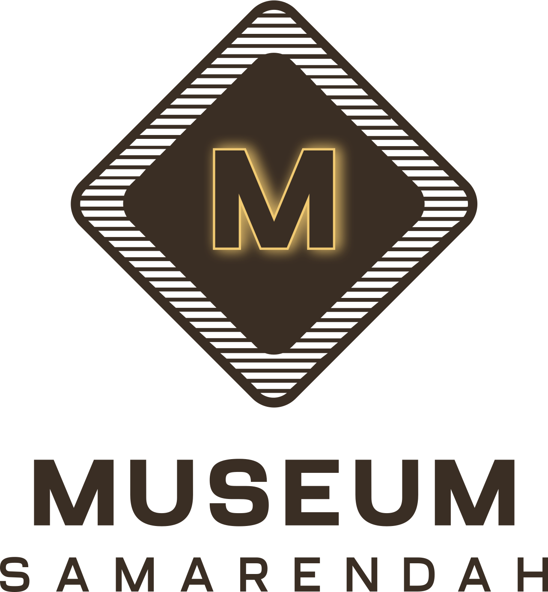

# ✦ Museum Kota Samarinda
### *Website Informasi & Digitalisasi Museum Berbasis Web*

<p>
  
  
  
  
  
  
</p>

<p>
  <a href="http://museum-smr.ct.ws/">
    
  </a>
</p>

> *Menyajikan warisan budaya Kota Samarinda dalam satu layar — modern, informatif, dan mudah diakses.*

</div>

---

## **Deskripsi Aplikasi** ★

Website **Museum Kota Samarinda** adalah sistem informasi berbasis web yang dikembangkan sebagai solusi digitalisasi museum untuk masyarakat luas. Hadir sebagai pengembangan mandiri dari sistem lama yang masih tergabung dengan platform UPTD; kini lebih terstruktur, kaya fitur, dan mudah diakses tanpa harus datang langsung ke lokasi.

Sistem memiliki dua jenis pengguna: **Admin** yang mengelola seluruh data museum secara terpusat, dan **Pengunjung (User)** yang dapat mengakses informasi, memberikan ulasan, serta mengajukan peminjaman ruangan secara online.

> **Museum Kota Samarinda**, Kalimantan Timur, Indonesia  
> 🌐 Live Hosting: [http://museum-smr.ct.ws/](http://museum-smr.ct.ws/)

---

## **Fitur Website** ⸝⸝.ᐟ⋆.ᐟ

### Features Checklist ᯓ★

**Fitur Wajib:**
- [x] Halaman Beranda yang menampilkan informasi umum Museum Kota Samarinda
- [x] Halaman Detail Wisata (profil, koleksi, fasilitas, lokasi, jam operasional)
- [x] Sistem CRUD — Tambah, Tampilkan, Edit, Hapus data koleksi, berita, dan kegiatan
- [x] Menggunakan PHP untuk pengolahan data server-side
- [x] Menggunakan MySQL sebagai database utama
- [x] File koneksi terpisah (`config/db.php`) menggunakan PDO + `require_once`
- [x] Session & Autentikasi — Login & Logout untuk membatasi akses admin
- [x] Tampilan responsif menggunakan Bootstrap 5 & Vue.js 3
- [x] Penamaan file rapi (`login.php`, `signup.php`, `home.php`, `api/koleksi.php`, dll)

**Nilai Tambah:**
- [x] Animasi 3D interaktif pada Landing Page menggunakan Three.js
- [x] Grafik statistik dashboard admin menggunakan Chart.js
- [x] Integrasi Google Maps untuk peta lokasi museum
- [x] Integrasi WhatsApp otomatis untuk konfirmasi peminjaman ruangan
- [x] Live search & filter kategori reaktif menggunakan Vue.js 3
- [x] Slide panel detail koleksi tanpa pindah halaman
- [x] Hosting website: [http://museum-smr.ct.ws/](http://museum-smr.ct.ws/)

---

## **Tools and Tech Stack** ᯓ★

### Core Technologies ⍟

- [x] **PHP** – Pengolahan data dan logika server-side
- [x] **MySQL** – Database utama penyimpanan seluruh data sistem
- [x] **PDO (PHP Data Objects)** – Koneksi database yang aman dan fleksibel
- [x] **Session PHP** – Autentikasi dan manajemen sesi pengguna
- [x] **JSON API** – Komunikasi data antara frontend dan backend

### Frameworks & Libraries ⍟

- [x] **Bootstrap 5.3** – Komponen UI responsif (tabel, badge, form, button)
- [x] **Vue.js 3** – Reactive UI untuk halaman koleksi dan berita (filter, live search, sorting)
- [x] **Three.js** – Animasi 3D tubes cursor interaktif pada Landing Page
- [x] **Chart.js** – Visualisasi grafik statistik pada dashboard admin
- [x] **Anime.js 3.2.1** – Animasi UI smooth dan transisi antar halaman
- [x] **Fetch API** – Komunikasi AJAX ke backend tanpa jQuery
- [x] **Google Maps Embed** – Integrasi peta lokasi museum interaktif

### Development Tools ⍟

- [x] **VS Code** – Code editor utama pengembangan
- [x] **XAMPP / PHP Built-in Server** – Local development environment
- [x] **MySQL Workbench** – Manajemen dan desain database
- [x] **Figma** – Desain prototype UI/UX high fidelity
- [x] **Git & GitHub** – Version control dan penyimpanan source code
- [x] **Free Hosting (ct.ws)** – Deployment website ke production

---

## **Implemented Features** ᯓ★

### Autentikasi & Manajemen Sesi

Sistem autentikasi dibangun menggunakan Session PHP. Pengguna wajib login sebelum mengakses fitur tertentu. Setiap request ke halaman admin dilindungi oleh `config/auth.php`.

- **Register** – Pendaftaran akun dengan nama, email, password, usia, dan pekerjaan
- **Login** – Validasi email & password, session dibuat jika cocok
- **Role Check** – Sistem membedakan `admin` dan `user` secara otomatis setelah login
- **Logout** – Sesi dihapus dan pengguna diarahkan ke halaman awal

```php
// config/auth.php — cek session & role
session_start();
if (!isset($_SESSION['user_id'])) {
    header('Location: /login.php');
    exit;
}
if ($_SESSION['role'] !== 'admin') {
    header('Location: /home.php');
    exit;
}
```

```php
// proses/login_proses.php — validasi & buat session
$stmt = $pdo->prepare("SELECT * FROM akun WHERE email = ?");
$stmt->execute([$email]);
$user = $stmt->fetch();

if ($user && password_verify($password, $user['password'])) {
    $_SESSION['user_id'] = $user['id'];
    $_SESSION['role']    = $user['peran'];
    header('Location: /home.php');
}
```

```php
// proses/signup_proses.php — hash password sebelum disimpan
$hash = password_hash($password, PASSWORD_DEFAULT);
$stmt = $pdo->prepare("INSERT INTO akun (nama, email, password, usia, pekerjaan, peran)
                        VALUES (?, ?, ?, ?, ?, 'user')");
$stmt->execute([$nama, $email, $hash, $usia, $pekerjaan]);
```

---

### CRUD dengan PHP & MySQL

Seluruh operasi data dilakukan melalui folder `api/` yang mengembalikan response JSON, dikonsumsi oleh JavaScript di frontend menggunakan Fetch API.

- **Create** – Data baru diinsert ke database, gambar diupload ke folder `uploads/`
- **Read** – Data diambil dari MySQL dan dikirim sebagai JSON
- **Update** – Data yang ada diperbarui berdasarkan ID
- **Delete** – Data dihapus dari database dengan konfirmasi sebelumnya

```php
// api/koleksi.php — Read & Create
if ($_SERVER['REQUEST_METHOD'] === 'GET') {
    $stmt = $pdo->query("SELECT k.*, ki.image_path
                          FROM koleksi k
                          LEFT JOIN koleksi_images ki ON k.id = ki.koleksi_id");
    echo json_encode($stmt->fetchAll(PDO::FETCH_ASSOC));
}

if ($_SERVER['REQUEST_METHOD'] === 'POST') {
    $stmt = $pdo->prepare("INSERT INTO koleksi
                            (nomor, nama_koleksi, kategori_id, deskripsi, era, kondisi, asal, lokasi)
                            VALUES (?, ?, ?, ?, ?, ?, ?, ?)");
    $stmt->execute([...]);
    echo json_encode(['success' => true]);
}
```

```javascript
// assets/js/admin-museum-samarinda.js — Fetch API
async function loadBerita() {
  const res  = await fetch('../api/berita.php');
  const data = await res.json();
  renderTable(data);
}

async function deleteBerita(id) {
  await fetch('../api/berita.php', {
    method: 'DELETE',
    headers: { 'Content-Type': 'application/json' },
    body: JSON.stringify({ id })
  });
  loadBerita();
}
```

---

### Koneksi Database (PDO)

```php
// config/db.php
$host   = 'localhost';
$dbname = 'museum_samarinda';
$user   = 'root';
$pass   = '';

try {
    $pdo = new PDO("mysql:host=$host;dbname=$dbname;charset=utf8", $user, $pass);
    $pdo->setAttribute(PDO::ATTR_ERRMODE, PDO::ERRMODE_EXCEPTION);
} catch (PDOException $e) {
    die(json_encode(['error' => $e->getMessage()]));
}
```

---

### Vue.js 3 — Filter & Live Search

Filter kategori dan live search dikelola secara reaktif menggunakan Vue.js 3 CDN tanpa build step. Tersedia di halaman Koleksi dan Berita.

```javascript
// assets/js/koleksi.js
const { createApp, ref, computed } = Vue;

createApp({
  setup() {
    const items        = ref([]);
    const search       = ref('');
    const activeFilter = ref('');

    const filtered = computed(() =>
      items.value
        .filter(i => !activeFilter.value || i.kategori === activeFilter.value)
        .filter(i => i.nama_koleksi.toLowerCase().includes(search.value.toLowerCase()))
    );

    return { items, search, activeFilter, filtered };
  }
}).mount('#app-koleksi');
```

---

### Landing Page — Three.js 3D Animation

Halaman pembuka (`index.html`) menggunakan Three.js untuk menghasilkan animasi latar belakang 3D tubes interaktif yang responsif terhadap gerakan kursor. Dilengkapi countdown 60 detik dan efek transisi flash saat masuk ke beranda.

```javascript
// index.html — Three.js tubes cursor
import TubesCursor from
  'https://cdn.jsdelivr.net/npm/threejs-components@0.0.19/build/cursors/tubes1.min.js';

TubesCursor.init(document.getElementById('canvas'), {
  colors: [0x2D6A4F, 0x40916C, 0x74C69D],
  tubeMeshes: 30
});
```

---

### Dashboard Admin — Chart.js

Grafik statistik ditampilkan di halaman dashboard admin menggunakan Chart.js, menampilkan ringkasan jumlah koleksi, event, berita, dan peminjaman secara visual.

```javascript
// assets/js/admin-museum-samarinda.js
statsChart = new Chart(ctx, {
  type: 'bar',
  data: {
    labels: ['Koleksi', 'Event', 'Berita', 'Peminjaman'],
    datasets: [{
      label: 'Jumlah Data',
      data: [totalKoleksi, totalEvent, totalBerita, totalPeminjaman],
      backgroundColor: ['#2D6A4F', '#40916C', '#74C69D', '#B7E4C7']
    }]
  }
});
```

---

### Peminjaman Ruangan + WhatsApp Integration

Setelah pengguna mengisi form peminjaman dan melihat pratinjau, data secara otomatis diformat dan dikirim via WhatsApp ke nomor pengelola museum — tanpa perlu input ulang.

```javascript
// assets/js/peminjaman.js
function kirimWhatsApp(data) {
  const pesan = `*Permohonan Peminjaman Ruangan*\n` +
    `Nama     : ${data.nama_peminjam}\n` +
    `Instansi : ${data.instansi}\n` +
    `Kegiatan : ${data.nama_kegiatan}\n` +
    `Tanggal  : ${data.tanggal_mulai} s/d ${data.tanggal_selesai}\n` +
    `Peserta  : ${data.jumlah_peserta} orang`;

  const url = `https://wa.me/62XXXXXXXXXX?text=${encodeURIComponent(pesan)}`;
  window.open(url, '_blank');
}
```

---

### Bootstrap 5 — Tabel Admin

Tabel pada halaman admin menggunakan komponen Bootstrap 5 dengan `table-dark` thead untuk tampilan yang lebih tegas dan profesional.

```html
<!-- admin/berita.php -->
<div class="table-responsive">
  <table class="data-table table table-hover table-bordered" id="berita-table">
    <thead class="table-dark">
      <tr>
        <th>Tanggal</th>
        <th>Judul Berita</th>
        <th>Kategori</th>
        <th>Status</th>
        <th>Aksi</th>
      </tr>
    </thead>
    <tbody id="berita-tbody"></tbody>
  </table>
</div>
```

---

## **Rancangan Database** ⊹ ࣪ ˖ ✔

```sql
CREATE TABLE akun (
  id INT PRIMARY KEY AUTO_INCREMENT,
  nama VARCHAR(100), email VARCHAR(100) UNIQUE,
  password VARCHAR(255), usia INT,
  pekerjaan VARCHAR(100), peran ENUM('admin','user')
);

CREATE TABLE koleksi (
  id INT PRIMARY KEY AUTO_INCREMENT,
  nomor VARCHAR(50), nama_koleksi VARCHAR(200),
  kategori_id INT, deskripsi TEXT,
  era VARCHAR(100), kondisi VARCHAR(100),
  asal VARCHAR(100), lokasi VARCHAR(100)
);

CREATE TABLE koleksi_images (
  id INT PRIMARY KEY AUTO_INCREMENT,
  koleksi_id INT, image_path VARCHAR(255)
  -- relasi one-to-many: 1 koleksi bisa punya banyak gambar
);

CREATE TABLE berita (
  id INT PRIMARY KEY AUTO_INCREMENT,
  judul VARCHAR(255), ringkasan TEXT, isi LONGTEXT,
  thumbnail VARCHAR(255), kategori VARCHAR(100), tanggal_publish DATE
);

CREATE TABLE event (
  id INT PRIMARY KEY AUTO_INCREMENT,
  nama_event VARCHAR(200), deskripsi TEXT,
  tanggal_mulai DATE, tanggal_selesai DATE,
  jam TIME, kategori VARCHAR(100),
  tempat VARCHAR(200), status VARCHAR(50)
);

CREATE TABLE peminjaman_ruang (
  id INT PRIMARY KEY AUTO_INCREMENT,
  user_id INT, nama_peminjam VARCHAR(100),
  instansi VARCHAR(200), email VARCHAR(100), no_hp VARCHAR(20),
  nama_kegiatan VARCHAR(200), tanggal_mulai DATE, tanggal_selesai DATE,
  jumlah_peserta INT, deskripsi_kegiatan TEXT,
  status ENUM('pending','disetujui','ditolak')
);

CREATE TABLE komentar (
  id INT PRIMARY KEY AUTO_INCREMENT,
  user_id INT, isi_komentar TEXT, tanggal DATETIME
);
```

---

## **Library Structure** ⊹ ࣪ ˖ ✔

```
museum-kota-samarinda/
│
├── 📂 admin/               → Halaman pengelolaan data (khusus admin)
│   ├── index.php           → Dashboard admin + grafik Chart.js
│   ├── koleksi.php         → Kelola koleksi museum
│   ├── event.php           → Kelola kegiatan/event
│   ├── berita.php          → Kelola berita & artikel (Bootstrap table-dark)
│   └── peminjaman.php      → Kelola permohonan peminjaman
│
├── 📂 api/                 → Backend API — mengembalikan JSON
│   ├── koleksi.php         → CRUD koleksi
│   ├── kegiatan.php        → CRUD kegiatan
│   ├── berita.php          → CRUD berita
│   ├── peminjaman.php      → CRUD peminjaman
│   ├── ulasan.php          → Ulasan pengunjung
│   ├── dashboard.php       → Ringkasan data dashboard
│   └── stats.php           → Data statistik grafik
│
├── 📂 config/              → Konfigurasi sistem
│   ├── db.php              → Koneksi database PDO
│   └── auth.php            → Autentikasi & otorisasi session
│
├── 📂 assets/
│   ├── css/                → Stylesheet per halaman + global
│   └── js/                 → JavaScript per halaman + admin
│
├── 📂 images/              → Gambar koleksi museum (per kategori)
│   ├── etnografika/        → Alat musik, pakaian adat, mandau, dll
│   └── keramologi/         → Guci, mangkok, keramik
│
├── 📂 uploads/             → File upload dari admin
│   ├── berita/             → Thumbnail berita
│   └── koleksi/            → Foto koleksi baru
│
├── 📂 proses/              → Handler form autentikasi
│   ├── login_proses.php    → Proses login + buat session
│   ├── signup_proses.php   → Proses registrasi + hash password
│   └── logout.php          → Hapus session & redirect
│
├── 📂 templates/           → Komponen reusable (header, sidebar, modal, toast)
│
├── index.html              → Landing Page (Three.js 3D animation)
├── home.php                → Beranda utama pengguna
├── koleksi.php             → Katalog koleksi (Vue.js)
├── event.php               → Halaman kegiatan/event
├── berita.php              → Halaman berita (Vue.js)
├── peminjaman.php          → Form peminjaman ruangan + WhatsApp
├── ulasan.php              → Halaman ulasan pengunjung
├── tentang.php             → Profil & sejarah museum
├── peta.php                → Peta lokasi (Google Maps)
├── login.php               → Halaman login
└── signup.php              → Halaman registrasi
```

---

## **Program Flows** ⭑ & Graphical User Interface (GUI) —͟͟͞͞★

### Landing Page ⍟
> 📌 *Screenshot Landing Page — Three.js 3D tubes animation, opening card, countdown timer*
> 
> 
>

---

### Login & Register Page ⍟
> 📌 *Login Page*
> 
>
> 📌 *Insert screenshot Register / Daftar Akun Page*
> 
>
---

### Beranda (Home) ⍟
> 📌 *Screenshot Beranda — hero section + koleksi unggulan*
> 
> 
> 📌 *Beranda — section event, berita, ulasan*
> 
> 
> 
---

### Katalog Koleksi ⍟
> 📌 *Katalog koleksi — grid card + filter kategori*
> 
> 📌 *Screenshot slide panel detail koleksi*
> 
>
---

### Kegiatan & Event ⍟
> 📌 *Insert screenshot halaman event — daftar event + sidebar*

---

### Berita ⍟
> 📌 *Insert screenshot halaman berita — grid artikel + filter Vue.js*

---

### Peminjaman Ruangan ⍟
> 📌 *Insert screenshot form peminjaman + kalender ketersediaan*

> 📌 *Insert screenshot pratinjau & kirim ke WhatsApp*

---

### Peta Lokasi ⍟
> 📌 *Insert screenshot halaman peta — Google Maps embed*

---

### Tentang Museum ⍟
> 📌 *Insert screenshot profil museum — sejarah, visi misi, linimasa*

---

### Ulasan & Kesan ⍟
> 📌 *Insert screenshot halaman ulasan + form komentar*

---

### Dashboard Admin ⍟
> 📌 *Insert screenshot dashboard admin — ringkasan data + grafik Chart.js*

---

### Admin — Kelola Koleksi ⍟
> 📌 *Insert screenshot tabel koleksi + modal tambah/edit/hapus*

---

### Admin — Kelola Kegiatan ⍟
> 📌 *Insert screenshot tabel kegiatan + modal*

---

### Admin — Kelola Berita ⍟
> 📌 *Insert screenshot tabel berita Bootstrap (table-dark) + modal*

---

### Admin — Kelola Peminjaman ⍟
> 📌 *Insert screenshot daftar permohonan + filter status*

---

### Flowchart Login & Registrasi ⍟
> 📌 *Insert Flowchart Login & Registrasi*

---

### Flowchart Alur Pengguna ⍟
> 📌 *Insert Flowchart Alur Pengguna (User)*

---

### Flowchart Alur Admin ⍟
> 📌 *Insert Flowchart Alur Admin (CRUD Koleksi, Kegiatan, Berita)*

---

## **Tim Pengembang** ᯓ★

| No | Nama | NIM | Kontribusi |
|----|------|-----|------------|
| 1 | **Hendri Zaidan Safitra** | 2409116013 | Backend, Frontend |
| 2 | **Putri Syafana Afrillia** | 2409116015 | Project-Manager, Fullstack, Database, Hosting |
| 3 | **Indah Putri Lestari** | 2409116004 | Flowchart, Database, Laporan |
| 4 | **Narendra Augusta Srianandha** | 2409116010 | Design Figma, Frontend |

---

## **Mata Kuliah** ★

> **Pemrograman Berbasis Web**  
> Dosen Pengampu: **Ir. M. Ibadurrahman Arrasyid, S.Kom., M.Kom**  
> Program Studi Sistem Informasi — Fakultas Teknik  
> **Universitas Mulawarman** · 2026/2027

---

<div align="center">

*© 2026 Museum Kota Samarinda Website — Sistem Informasi, Universitas Mulawarman*

</div>
